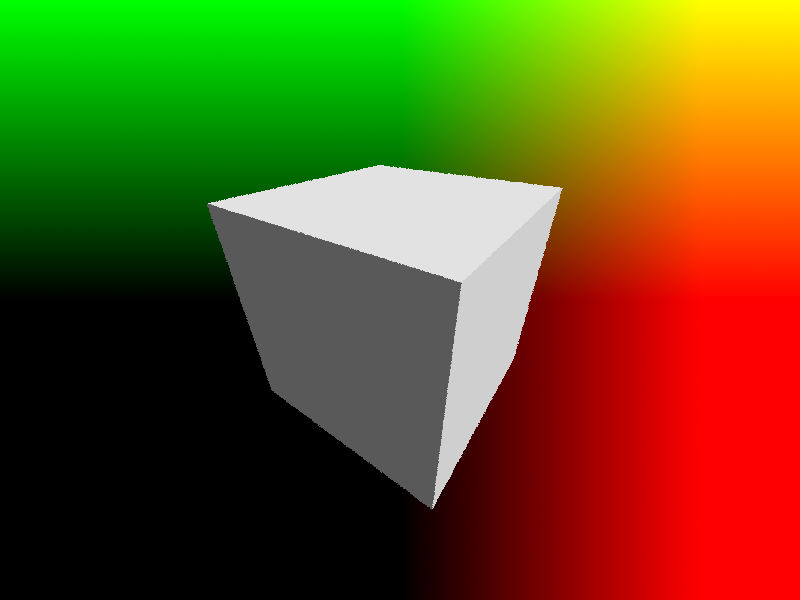

RPU is a GLSL / C like programming language which compiles to WebAssembly (WAT) and is currently under development.

You can use it as a general purpose programming language, as a shader language for 2D and 3D renderering and as a (very) fast embedded scripting language for Rust based applications.

RPU compiles to WAT code and uses [wasmer](https://crates.io/crates/wasmer) as a runtime. The GLSL features like vecs, swizzles and math functions get compiled on-demand. They do not introduce any overhead or speed / size penalties if not used.

You can choose between 32 and 64 bit precision during compile time.

All vector based operations (length, dot, cross etc) are implemented in pure WebAssembly. Trigonometric functions are implemented in Rust and are called via the wasmer runtime.

When working on shaders, RPU uses multiple threads to render the image. This is done by splitting the image into tiles and rendering each tile in parallel.

# Currently implemented

- [x] Basic types: int, ivec2, ivec3, ivec4, float, vec2, vec3, vec4
- [x] Math operators: +, -, \*, /
- [x] Math functions: dot, cross, mix, smoothstep, length, normalize, sin, cos, sqrt, ceil, floor, fract, abs, tan, degrees, radians, min, max, pow, rand
- [x] Control structures: if, else, ternary (?:), while, break, return, const, export
- [x] Swizzles: vec2.xy, vec3.xyz, vec4.xyzw etc

# Usage

You can use the RPU compiler as a [standalone tool](https://crates.io/crates/rpuc) or as a [crate](https://crates.io/crates/rpu) in your Rust project.

# Why RPU?

Sometimes you want to use high precision offline rendering without all the hazzles of the GPU and getting your shaders to compile.

For example I prefer to render SDFs on the CPU, especially when I want to use a lot of them or if the amount of SDFs to render are not known at compile time (user based input).

Using RPU you can use the same code for both CPU and GPU rendering.

# Examples

Fibonacci example like in a general purpose language:

```glsl
int fib(int n) {
  if (n <= 1) return n;
  return fib(n - 2) + fib(n - 1);
}

export int main(int x) {
  return fib(x);
}
```

You can see the generated WAT file [here](/examples/fib.wat).

To execute it with a secuence of 42 run `cargo run --release -- --source examples/fib.rpu -f main -a 42`. It executes in about a second on my M3.

---

A simple shader example using raymarching:

```glsl
// Based on https://www.shadertoy.com/view/WtGXDD

float sdBox(vec3 p, vec3 s) {
    p = abs(p)-s;
	return length(max(p, 0.))+min(max(p.x, max(p.y, p.z)), 0.);
}

float GetDist(vec3 p) {
    float d = sdBox(p, vec3(.5));
    return d;
}

vec3 GetRayDir(vec2 uv, vec3 p, vec3 l, float z) {
    vec3 f = normalize(l-p);
    vec3 r = normalize(cross(vec3(0,1,0), f));
    vec3 u = cross(f,r);
    vec3 c = f*z;
    vec3 i = c + uv.x*r + uv.y*u;
    return normalize(i);
}

vec3 GetNormal(vec3 p) {
    vec2 e = vec2(0.001, 0.);
    vec3 n = GetDist(p) - vec3(GetDist(p-e.xyy), GetDist(p-e.yxy), GetDist(p-e.yyx));
    return normalize(n);
}

export vec4 shader(vec2 coord, vec2 resolution) {
    // Generate the uv with random jittering for anti-aliasing
    vec2 uv = (2.0 * (coord + vec2(rand(), rand())) - resolution.xy) / resolution.y;

    vec3 ro = vec3(.7, .8, -1.);
    vec3 rd = GetRayDir(uv, ro, vec3(0), 1.);

    float t = 0.;
    float max_t = 10.;

    vec4 col = vec4(uv.x, uv.y, 0., 1.);

    while (t < max_t) {
        vec3 p = ro + rd * t;
        float d = GetDist(p);
        if (abs(d) < 0.001) {
            vec3 n = GetNormal(p);
            float dif = dot(n, normalize(vec3(1, 2, 3))) * 0.5 + 0.5;
            col.xyz = pow(vec3(dif), .4545);

            break;
        }
        t = t + d;
    }

    return col;
}
```

By executing the shader it generates the following image:


This runs in about 150ms in 800x600 in 64-bit on my machine. You can run the example with `cargo run --release -- --source examples/raymarch.rpu -f shader`.
