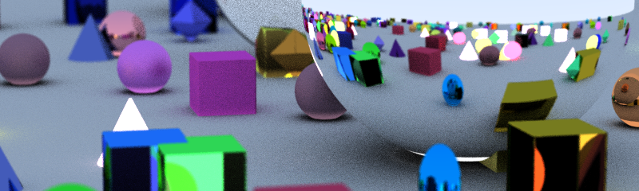

RPU is a GLSL compatible programming language for rendering procedural graphics on the CPU.

For more information visit [rpu-lang.org](https://rpu-lang.org/).

# Usage

Run rpuc with the source file, the function to execute and the optional argument:

`rpuc --source examples/fib.rpu --function main --argument 10`

this will return `[I64(55)]` which is the 10th Fibonacci number.

To execute a shader use

`rpuc --source examples/raymarch.rpu --function shader`. The resulting image will be saved as `examples/raymarch.png`.

For shaders you can specify the tile size with `--tiled 100x100` (default is `80x80`), and the number of iterations (in case your shader is a pathtracer) with `--iterations 100` (default is `1`).
